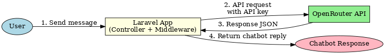

# Laravel Chatbot with OpenRouter API

This project is a Laravel-based chatbot application integrated with the **OpenRouter API** for intelligent responses.  
The setup includes security hardening, CORS configuration, CSRF handling, and environment variable management.

---

## 🚀 Features
- Laravel 10+ backend
- OpenRouter API integration for chatbot responses
- Configurable CORS and CSRF exceptions
- Custom security headers middleware
- Environment-based secure configuration

---

## 📂 Installation & Setup

### 1. Clone Repository
```bash
git clone https://github.com/flexavior/flex-laravel-chatbot.git
cd laravel-chatbot
```

### 2. Install Dependencies
```bash
composer install
npm install && npm run build
```

### 3. Configure Environment
Copy `.env.example` to `.env`:
```bash
cp .env.example .env
```

Set required environment variables in `.env`:
```dotenv
APP_URL=https://www.yourdomain.com
DB_CONNECTION=mysql
DB_HOST=127.0.0.1
DB_PORT=3306
DB_DATABASE=your_database
DB_USERNAME=your_username
DB_PASSWORD=your_password

# OpenRouter API
OPENROUTER_API_KEY=your_openrouter_api_key
```

### 4. Run Migrations
```bash
php artisan migrate
```

### 5. Serve Application
```bash
php artisan serve
```

---

## ⚙️ Configuration

### **Security Headers**
Add custom headers to `app/Http/Middleware/SecurityHeaders.php`:
```php
public function handle($request, Closure $next)
{
    $response = $next($request);

    $response->headers->set('X-Frame-Options', 'SAMEORIGIN');
    $response->headers->set('X-Content-Type-Options', 'nosniff');
    $response->headers->set('Referrer-Policy', 'strict-origin-when-cross-origin');
    $response->headers->set('Permissions-Policy', 'geolocation=(), microphone=()');

    return $response;
}
```

### **CSRF Protection**
Add exceptions to `app/Http/Middleware/VerifyCsrfToken.php` if needed:
```php
protected $except = [
    '/send', // Exclude chatbot send endpoint from CSRF protection
];
```
> Only exclude endpoints that require it. All others must remain protected.

### **CORS Configuration**
Update `config/cors.php`:
```php
'allowed_origins' => [
    'https://www.yourdomain.com',   // Parent domain
    'https://*.yourdomain.com',     // Optional: Allow subdomains
],
```

---

## 🔒 Security Checklist
- [x] **Environment Variables**: Store all secrets (`DB_PASSWORD`, `OPENROUTER_API_KEY`) in `.env`, not in code.  
- [x] **CSRF**: Only exclude necessary API routes.  
- [x] **CORS**: Restrict to known domains.  
- [x] **Security Headers**: Implemented via middleware.  
- [x] **HTTPS**: Enforce SSL in production (`APP_URL=https://...`).  

---

## 📡 API Integration (OpenRouter)
Example usage inside a controller:
```php
use Illuminate\Support\Facades\Http;

$response = Http::withToken(env('OPENROUTER_API_KEY'))
    ->post('https://openrouter.ai/api/v1/chat/completions', [
        'model' => 'openai/gpt-3.5-turbo',
        'messages' => [
            ['role' => 'system', 'content' => 'You are a helpful chatbot.'],
            ['role' => 'user', 'content' => 'Hello!'],
        ],
    ]);

$data = $response->json();
```

---

## 🛠 Development Notes
- Ensure your server runs **PHP 8.1+** and **MySQL 8+**
- Use **Redis/Queue** if scaling message handling
- Always keep `.env` out of version control

---

## 📊 System Flow Diagram


---

## 📄 License
This project is licensed under the MIT License.
"# Laravel-ChatBot" 
